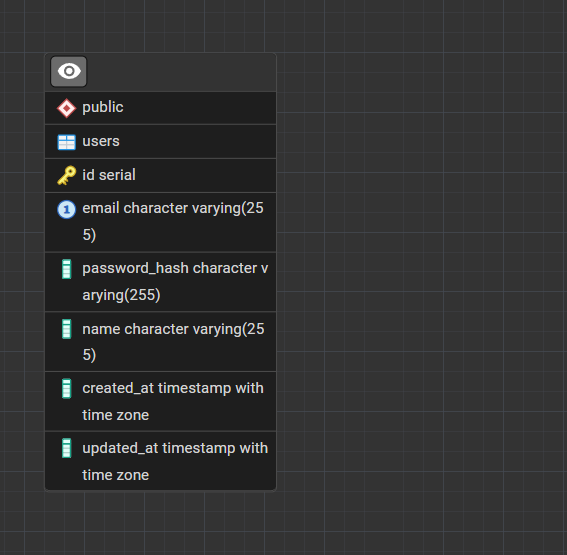

# BankScoreAI Backend

Ini adalah backend untuk aplikasi BankScoreAI. Ini menyediakan API RESTful untuk otentikasi pengguna dan fitur lainnya.

## Memulai

Instruksi ini akan membantu Anda mendapatkan salinan proyek yang berjalan di mesin lokal Anda untuk tujuan pengembangan dan pengujian.

### Syarat 

* Bun
* PostgreSQL

### Instalasi

1. Kloning repositori:
   ```sh
   git clone https://github.com/Capstone-Asah-Team-A25-CS091/bankscoreai-backend.git
   ```
2. Instal dependensi:
   ```sh
   bun install
   ```
3. Buat file `.env` di root proyek dengan variabel berikut:
   ```
   DB_USER=your_db_user
   DB_HOST=your_db_host
   DB_DATABASE=capstone_asah
   DB_PASSWORD=your_db_password
   DB_PORT=your_db_port
   JWT_SECRET=your_jwt_secret
   ```
4. Jalankan migrasi database:
   ```sh
   bun run migrate
   ```
5. Mulai server:
   ```sh
   bun run start
   ```

Server akan berjalan di `http://localhost:3000`.

## Database

Berikut adalah Entity-Relationship Diagram (ERD) untuk database yang digunakan dalam proyek ini.



## Dokumentasi API

### Otentikasi

#### `POST /api/auth/register`

Mendaftarkan pengguna baru.

**Request Body:**

```json
{
  "email": "user@example.com",
  "password": "password123",
  "name": "John Doe"
}
```

**Response:**

```json
{
  "status": "success",
  "code": 201,
  "data": {
    "user": {
      "id": 1,
      "email": "user@example.com",
      "name": "John Doe"
    },
    "token": "token_jwt_anda"
  }
}
```

#### `POST /api/auth/login`

Masuk sebagai pengguna.

**Request Body:**

```json
{
  "email": "user@example.com",
  "password": "password123"
}
```

**Response:**

```json
{
  "status": "success",
  "code": 200,
  "data": {
    "user": {
      "id": 1,
      "email": "user@example.com",
      "name": "John Doe"
    },
    "token": "token_jwt_anda"
  }
}
```

#### `PUT /api/auth/password`

Memperbarui kata sandi pengguna yang terotentikasi.

**Header:**

* `Authorization`: `Bearer token_jwt_anda`

**Request Body:**

```json
{
  "oldPassword": "password123",
  "newPassword": "newpassword456"
}
```

**Response:**

```json
{
  "status": "success",
  "code": 200,
  "message": "Kata sandi berhasil diperbarui"
}
```